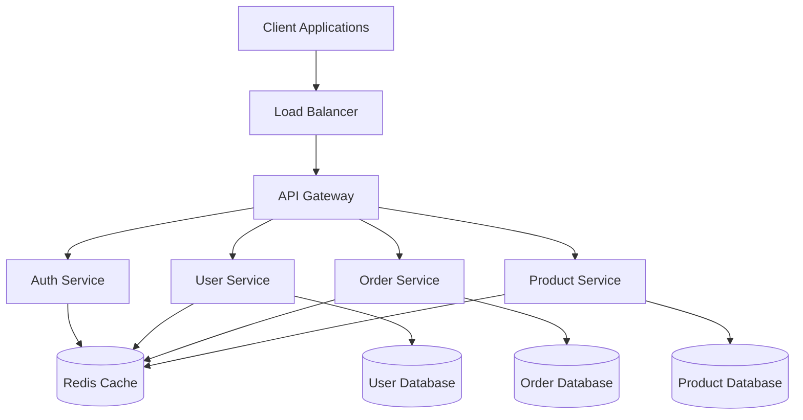
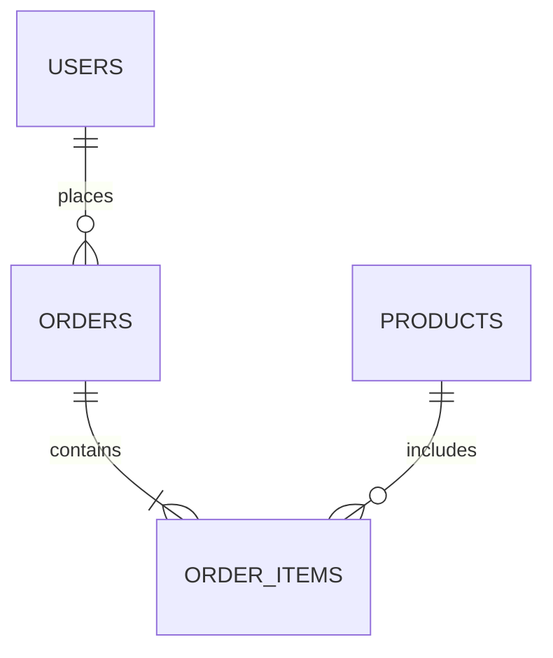
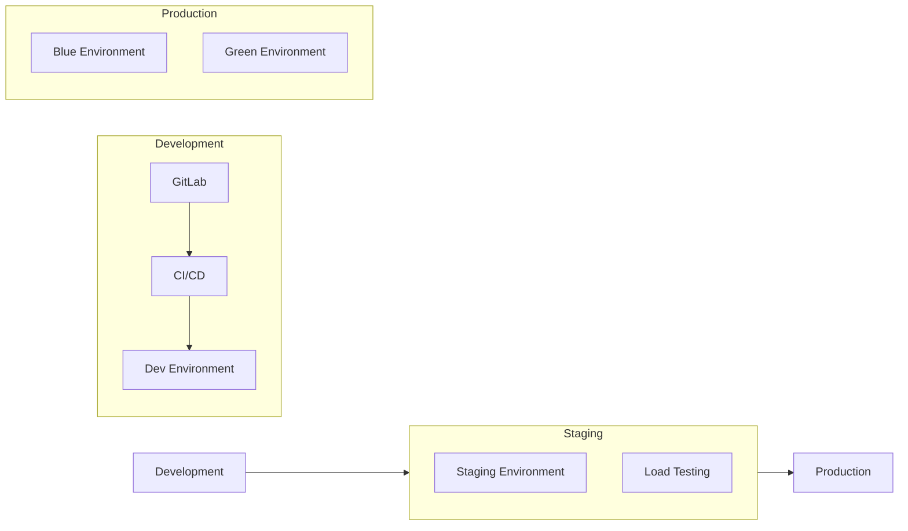
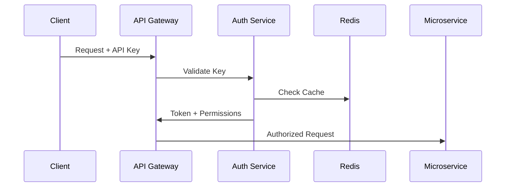

# System Architecture

## System Overview



## Core Components

### Frontend Architecture

- **Framework**: Next.js
- **State Management**: Redux Toolkit
- **UI Components**: Tailwind CSS
- **API Client**: Axios with custom interceptors

### Backend Services

#### API Gateway
- Node.js/Express
- Rate limiting
- Request validation
- Authentication/Authorization
- Request routing

#### Microservices
```yaml
services:
  auth:
    language: Node.js
    framework: Express
    database: Redis
    
  users:
    language: Go
    framework: Gin
    database: PostgreSQL
    
  orders:
    language: Go
    framework: Gin
    database: PostgreSQL
    
  products:
    language: Go
    framework: Gin
    database: PostgreSQL
```

## Database Architecture

### Primary Databases



### Caching Strategy

```typescript
interface CacheConfig {
  type: 'Redis';
  strategy: 'write-through' | 'write-behind';
  ttl: {
    users: '1h';
    products: '24h';
    orders: '15m';
  };
  invalidation: {
    method: 'event-based';
    backup: 'time-based';
  };
}
```

## Infrastructure

### Cloud Architecture

- **Provider**: AWS
- **Region**: us-east-1 (primary)
- **Backup**: us-west-2

### Deployment



## Security Architecture

### Authentication Flow



### Data Protection

- Encryption at rest
- TLS 1.3 in transit
- Regular security audits
- Automated vulnerability scanning

## Monitoring & Observability

### Metrics Collection

```yaml
monitoring:
  metrics:
    - response_time
    - error_rate
    - request_rate
    - cpu_usage
    - memory_usage
    
  alerts:
    - high_error_rate
    - high_latency
    - service_down
    
  dashboards:
    - system_health
    - service_metrics
    - business_metrics
```

## Disaster Recovery

### Backup Strategy

- Daily database backups
- Cross-region replication
- Point-in-time recovery
- Regular DR testing

### Recovery Time Objectives

| Service | RTO | RPO |
|---------|-----|-----|
| Critical | 1h | 5min |
| Important | 4h | 1h |
| Non-critical | 24h | 24h | 