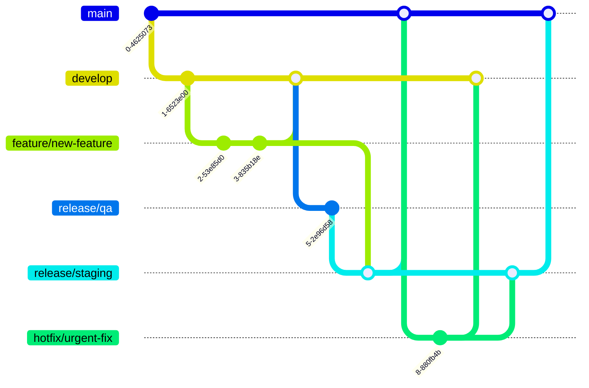

## Overview

Our company uses a modified version of the Gitflow branching model that prioritizes stability and controlled releases. This document outlines our specific branching strategy and common scenarios developers encounter.

## Core Branches

### Main Branch (`main`)

- Represents the official release history
- Contains production-ready code
- Source branch for hotfixes
- Never commit directly to `main`

### Development Branch (`develop`)

- Integration branch for features and fixes
- The first destination for all new features and changes
- Represents the latest delivered development changes
- Never create new feature branches from this branch

### QA Branch (`release/qa`)

- Testing environment branch
- Updated directly from `develop`
- Used for QA verification
- Never create new feature branches from this branch

### Staging Branch (`release/staging`)

- Pre-production environment branch
- Last step before production release
- Receives approved features and fixes
- Merges into `main` during production releases

<Note>
  All protected branches (`main`, `develop`, `release/qa`, `release/staging`) require pull requests and approvals.
  Direct commits to these branches are prohibited.
</Note>

## Working Branches

### Feature Branches (`feature/*`)

- Used for new features and changes
- Always branch from: `main`
- Must merge into: `develop` first
- Naming convention: `feature/feature-name`

### Hotfix Branches (`hotfix/*`)

- Used for urgent production fixes
- Always branch from: `main`
- Must merge into: `develop` first
- Naming convention: `hotfix/production-bug-name`

### Bugfix Branches (`bugfix/*`)

- Used for fixing unreleased features
- Branch from: parent feature/hotfix branch
- Must merge into: parent feature/hotfix branch
- Naming convention: `bugfix/bug-name`

## Common Scenarios

### Scenario 1: New Feature or Production Bug Fix

1. Create branch from `main`:

```bash
git checkout main
git checkout -b feature/feature-name
# or
git checkout -b hotfix/production-bug-name
```

2. Development workflow:
   - Make changes in your branch
   - Commit changes regularly
   - Push to remote repository
3. Pull Request flow:
   1. First PR: Your branch → `develop`
   2. After merge to develop: `develop` → `release/qa`
   3. After QA approval: Your branch → `release/staging`
   4. During release: `release/staging` → `main`

<Frame>
  
</Frame>

### Scenario 2: Fixing Unreleased Features

When fixing issues in unreleased features, you have two options:

#### Option 1: Use Existing Branch

If the fix will be released together with the parent feature:

- Continue working in the parent feature/hotfix branch
- Follow the same PR flow as Scenario 1

#### Option 2: Create a Bugfix Branch

If the fix might be released separately:

1. Create a bugfix branch from the parent feature:

```bash
git checkout feature/parent-feature
git checkout -b bugfix/bug-name
```

2. Follow the same PR flow as Scenario 1

## Important Rules

### DO NOT

- Create branches from `develop` or `release/qa`
- Pull/merge from `develop` or `release/qa` into your working branches
- Include unrelated changes in your staging PRs
- Commit directly to protected branches (`main`, `develop`, `release/qa`, `release/staging`)

### DO

- Always branch from `main` for new features and hotfixes
- Create separate branches for independent changes
- Keep staging PRs focused on single feature/fix changes
- Follow the proper PR flow through environments

<Warning>
  Merging branches in the wrong order can lead to deployment issues. Always follow the prescribed flow from feature/hotfix → develop → QA → staging → main.
</Warning>

## Branch Visualization


