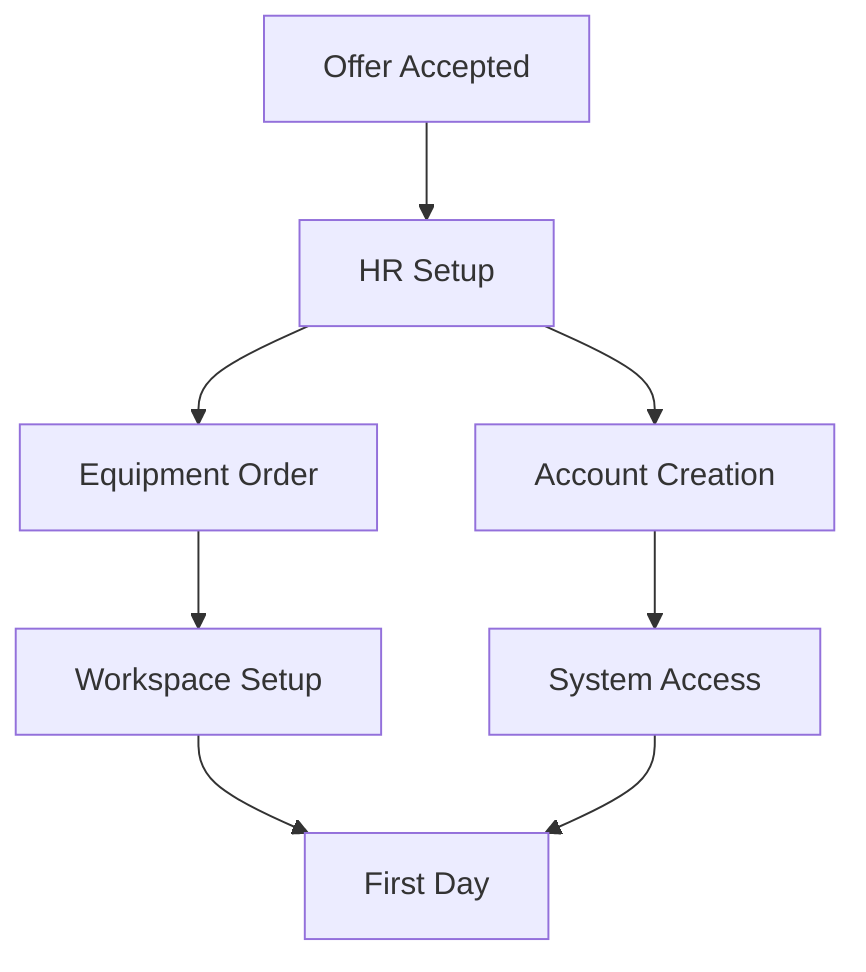

# Employee Onboarding

## Pre-arrival Checklist



## First Day

### Welcome Package
- Company laptop
- Employee handbook
- Office access card
- Welcome kit

### IT Setup

```bash
# System setup script
./setup-new-employee.sh \
  --email="firstname.lastname@company.com" \
  --department="engineering" \
  --access-level="standard"
```

## First Week

### Orientation Schedule

| Time | Activity | Location |
|------|----------|----------|
| Day 1 AM | Welcome & IT Setup | Main Office |
| Day 1 PM | Team Introduction | Team Area |
| Day 2 | Company Overview | Training Room |
| Day 3 | Department Training | Department |
| Day 4-5 | Role-specific Training | Various |

### System Access

```yaml
access_requirements:
  email:
    provider: Google Workspace
    groups: [team, department, company]
  
  development:
    github: true
    gitlab: false
    jira: true
    
  communication:
    slack: true
    zoom: true
    
  security:
    vpn: true
    2fa: required
```

## Training Modules

### Company Overview
- Mission and values
- Organization structure
- Products and services
- Company policies

### Role-specific Training

```typescript
interface TrainingPlan {
  core: {
    required: string[];
    timeline: string;
    mentor: string;
  };
  technical: {
    tools: string[];
    systems: string[];
    processes: string[];
  };
  soft_skills: {
    communication: boolean;
    teamwork: boolean;
    time_management: boolean;
  };
}
```

## 30-60-90 Day Plan

### 30 Days
- Complete all onboarding training
- Meet key team members
- Understand basic workflows

### 60 Days
- Work independently on tasks
- Contribute to team projects
- Provide feedback on processes

### 90 Days
- Take ownership of projects
- Mentor new team members
- Suggest improvements

## Resources

### Important Links
- Internal wiki
- HR portal
- IT support
- Training platform

### Contact Information
- HR representative
- Team lead
- IT support
- Office management 