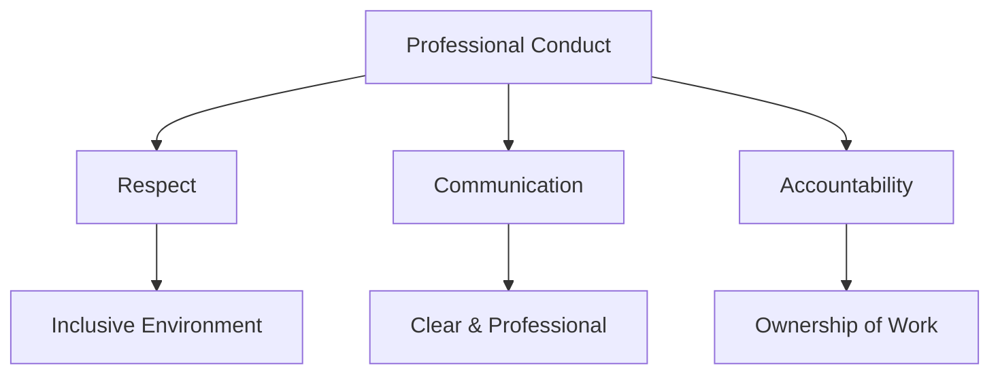

# HR Policies

## Code of Conduct

### Core Values
- Integrity
- Innovation
- Collaboration
- Excellence
- Diversity & Inclusion

### Professional Conduct



## Work Policies

### Working Hours
- Core hours: 10:00 AM - 4:00 PM
- Flexible schedule around core hours
- Remote work options available

### Leave Policy

| Type | Annual Allowance | Carry Forward |
|------|-----------------|---------------|
| Annual Leave | 25 days | 5 days |
| Sick Leave | 10 days | None |
| Personal Days | 3 days | None |
| Learning Days | 5 days | 2 days |

### Remote Work Guidelines

```yaml
remote_work:
  equipment:
    - Laptop
    - Monitor
    - Ergonomic chair
    - Internet allowance
  requirements:
    - Stable internet connection
    - Dedicated workspace
    - Regular availability during core hours
  communication:
    - Daily check-ins
    - Weekly team meetings
    - Monthly all-hands
```

## Benefits

### Health & Wellness
- Medical insurance
- Dental coverage
- Mental health support
- Fitness allowance

### Professional Development

```typescript
interface DevelopmentBenefits {
  education: {
    annualBudget: number;
    eligibility: 'all employees';
    coverage: [
      'online courses',
      'certifications',
      'conferences',
      'workshops'
    ];
  };
  mentorship: {
    type: 'internal' | 'external';
    frequency: 'monthly';
    duration: '6 months';
  };
}
```

## Compliance

### Equal Opportunity
- Non-discrimination policy
- Fair hiring practices
- Inclusive workplace initiatives

### Grievance Procedure
1. Informal discussion
2. Formal complaint
3. Investigation
4. Resolution
5. Appeal process

## Safety & Security

### Office Safety
- Emergency procedures
- First aid locations
- Fire safety protocols

### Data Security
- Confidentiality agreements
- Data protection policies
- Security training requirements 