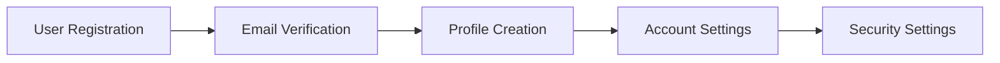

# Product Requirements

## Functional Requirements

### User Management



#### Authentication
- Email/password login
- Social authentication
- Two-factor authentication
- Password recovery

#### Authorization
- Role-based access control
- Permission management
- API key management

### Data Management

```typescript
interface DataRequirements {
  storage: {
    type: 'relational' | 'document' | 'graph';
    backupFrequency: 'hourly' | 'daily' | 'weekly';
    retentionPeriod: number; // days
  };
  processing: {
    batchSize: number;
    concurrency: number;
    timeout: number; // milliseconds
  };
  security: {
    encryption: boolean;
    auditLogging: boolean;
    dataClassification: 'public' | 'internal' | 'confidential';
  };
}
```

## Non-Functional Requirements

### Performance

| Metric | Target | Critical Threshold |
|--------|--------|-------------------|
| Response Time | < 200ms | < 500ms |
| Throughput | 1000 rps | 500 rps |
| Availability | 99.99% | 99.9% |
| Error Rate | < 0.1% | < 1% |

### Security

```yaml
security_requirements:
  authentication:
    - OAuth 2.0
    - JWT tokens
    - Rate limiting
  encryption:
    - Data at rest
    - Data in transit
    - Key rotation
  compliance:
    - GDPR
    - SOC 2
    - ISO 27001
```

### Scalability

```typescript
interface ScalabilityRequirements {
  horizontal: {
    maxInstances: number;
    autoScaling: boolean;
    scaleOutThreshold: number; // CPU percentage
  };
  vertical: {
    maxMemory: string;
    maxCPU: number;
    storageLimit: string;
  };
  database: {
    replication: boolean;
    sharding: boolean;
    readReplicas: number;
  };
}
```

## Technical Requirements

### API Design

- RESTful endpoints
- GraphQL support
- Websocket connections
- API versioning

### Integration Requirements

- Third-party APIs
- Payment processors
- Analytics services
- Email providers

## Compliance Requirements

### Data Protection

- GDPR compliance
- Data encryption
- Privacy controls
- Data retention policies

### Accessibility

- WCAG 2.1 compliance
- Screen reader support
- Keyboard navigation
- Color contrast ratios 