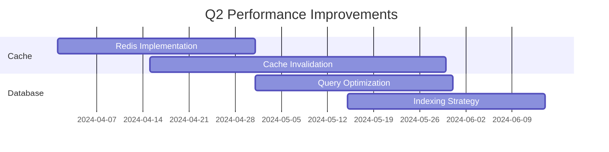

# Product Roadmap

## Q1 2024

### API Enhancements
- GraphQL API implementation
- Real-time websocket support
- Enhanced rate limiting

### Security Updates
- OAuth 2.0 implementation
- Two-factor authentication
- API key rotation system

## Q2 2024

### Performance Optimization


### New Features
- Bulk operations API
- Advanced analytics
- Custom webhooks

## Q3 2024

### Platform Expansion
- Mobile SDK release
- Desktop application
- Browser extensions

### Developer Experience
- Interactive API documentation
- Code generation tools
- Enhanced debugging tools

## Q4 2024

### Enterprise Features
- Single Sign-On (SSO)
- Audit logging
- Role-based access control

### Integration Ecosystem
- Third-party integrations
- Marketplace launch
- Partner API program

## Future Considerations

### 2025 Preview
- AI-powered features
- Blockchain integration
- Edge computing support

## Success Metrics

```javascript
const metrics = {
  adoption: {
    target: '50% YoY growth',
    measure: 'Monthly Active Users'
  },
  performance: {
    target: '99.99% uptime',
    measure: 'System Availability'
  },
  satisfaction: {
    target: '> 90% satisfaction',
    measure: 'NPS Score'
  }
};
```

## Release Schedule

| Feature | Target Date | Status |
|---------|-------------|--------|
| GraphQL API | Q1 2024 | In Progress |
| Mobile SDK | Q3 2024 | Planning |
| SSO | Q4 2024 | Research | 