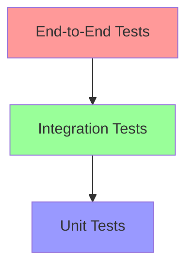

# Testing Strategy

## Testing Pyramid



## Unit Testing

```typescript
// Example unit test
describe('PaymentCalculator', () => {
  const calculator = new PaymentCalculator();

  test('calculates correct tax', () => {
    const amount = 100;
    const taxRate = 0.1;
    expect(calculator.calculateTax(amount, taxRate)).toBe(10);
  });

  test('handles zero amount', () => {
    const amount = 0;
    const taxRate = 0.1;
    expect(calculator.calculateTax(amount, taxRate)).toBe(0);
  });
});
```

## Integration Testing

```typescript
describe('UserService Integration', () => {
  let service: UserService;
  let db: Database;

  beforeAll(async () => {
    db = await Database.connect();
    service = new UserService(db);
  });

  test('creates and retrieves user', async () => {
    const user = await service.createUser({
      name: 'Test User',
      email: 'test@example.com'
    });

    const retrieved = await service.getUser(user.id);
    expect(retrieved).toEqual(user);
  });
});
```

## E2E Testing

```typescript
describe('Checkout Flow', () => {
  test('completes purchase successfully', async () => {
    await page.goto('/products');
    await page.click('[data-testid="add-to-cart"]');
    await page.click('[data-testid="checkout"]');
    
    await page.fill('#card-number', '4242424242424242');
    await page.fill('#expiry', '12/25');
    await page.fill('#cvc', '123');
    
    await page.click('#submit-payment');
    
    await expect(page).toHaveText('Thank you for your purchase!');
  });
});
```

## Performance Testing

```javascript
import { check } from 'k6';
import http from 'k6/http';

export const options = {
  vus: 10,
  duration: '30s',
};

export default function() {
  const res = http.get('http://test.k6.io');
  check(res, {
    'status is 200': (r) => r.status === 200,
    'response time < 200ms': (r) => r.timings.duration < 200
  });
}
```

## Test Coverage Requirements

- Unit Tests: 80% coverage
- Integration Tests: Key workflows
- E2E Tests: Critical user journeys
- Performance Tests: SLA requirements 