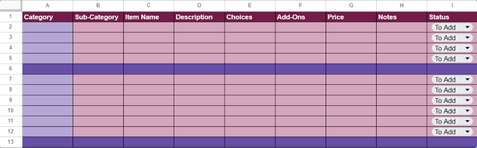
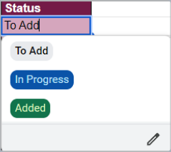
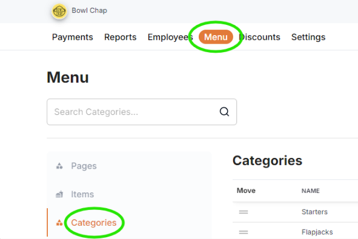
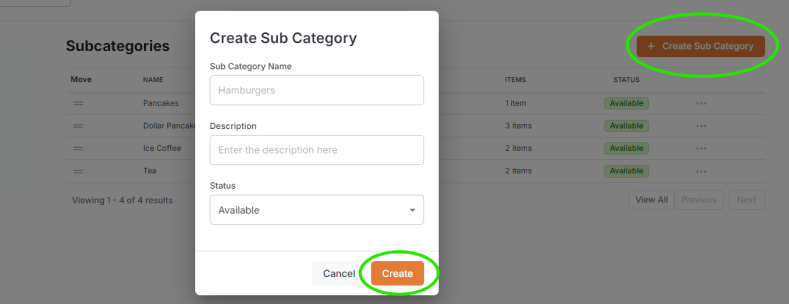

<Note>
This guide outlines the process for creating a new POS Restaurant Menu. It provides a detailed walkthrough to assist in structuring and organizing the necessary data for menu creation.
</Note>

---

## Creating a Menu Template for Data Extraction

> This section provides instructions for creating a structured spreadsheet template to standardize the process of collecting and extracting menu data from restaurants. By following these guidelines, consistency and completeness in the data will be ensured.

---

### Creating a New Spreadsheet

> To begin, open your preferred spreadsheet application (e.g., Microsoft Excel, Google Sheets) and create a new file. Name the spreadsheet appropriately, such as "Restaurant Menu Data" or "Setup."

---

### Setting Column Headers

> In the first row of the spreadsheet, create the following column headers to capture the necessary details for each menu item:

 - **Category**
 - **Sub-Category**
 - **Item Name**
 - **Description**
 - **Choices**
 - **Add-Ons**
 - **Price**
 - **Notes**
 - **Status**

---

## Template Layout

> For clarity on how the template should appear, refer to the image below, which visually represents the layout of the spreadsheet.

---

### Category and Sub-Category

> In the **Category** column, specify the main groups of menu items (e.g., **Desserts**, **Beverages**, **Snacks**). The **Sub-Category** column is for further classification under each main category (e.g., under **Desserts**, list **Ice Creams**, **Mousse**, or **Cheesecakes**).

---

### Item Details

> Use the **Item Name** column to list the names of the menu items. In the **Description** column, provide a brief explanation, such as key ingredients or flavor profiles.

---

### Choices and Add-Ons

 - The **Choices** column should list any available options for the item, such as different sizes, flavors, or preparation methods.
 - The **Add-Ons** column is for specifying extra toppings or side items that can be added to the dish.

---

### Pricing

> In the **Price** column, enter the cost of the menu item. Some items may have a base price of $0.00, with final prices determined by choices.

---

### Additional Notes

> The **Notes** column is for any special instructions that may apply to the item.

---

### Status

> The **Status** column is used to track the progress of each item with a dropdown menu that includes the following options:
 
 - To Add
 - In Progress
 - Completed

---

## Subsections for Add-Ons and Choices

### Add-Ons Group

> Create a section in the spreadsheet for listing add-ons available for various menu items. Include the following columns:
 
 - **Name**: The name of the add-on (e.g., extra cheese, bacon).
 - **Price**: The price of the add-on.
 - **Status**: Track the progress of adding the add-on with statuses like "To Add", "In Progress", or "Completed".

### Choice Groups

> Create a separate section for choice options (e.g., sizes, flavors). Include the following columns:
 
 - **Choice**: The name of the choice (e.g., small, medium, large).
 - **Price**: The price associated with the choice (if applicable).
 - **Status**: Track the progress of adding choices with statuses like "To Add", "In Progress", or "Completed".

---

## Adding the Items

To begin adding items, log in to the **[Backoffice](https://backoffice.eatmeglobal.com/)** using your account credentials. Once logged in, navigate to the **Menu** section, and then click on **Categories** to start adding categories.

### Categories

 - Click the **Create Category** button.
 - Enter the **Category Name**.
 - The **Description** field is optional and can be skipped if not required.
 - Ensure the **Status** is set to **Available** so it appears in the POS system.
 - Press the **Create** button to finalize.

### Sub-Categories

 - Navigate to the **Subcategories** section.
 - Click the **Create Subcategory** button.
 - Enter the **Subcategory Name**.
 - The **Description** field is optional and can be skipped if not required.
 - Ensure the **Status** is set to **Available** so it appears in the POS system.
 - Press the **Create** button.

### Modifiers (Choices / Add-Ons)

> - **Choices**: Define optional variations for menu items (e.g., sizes or flavors), with settings for visibility, requirement, and limits.
> - **Add-Ons**: List additional items that can be paired with menu items (e.g., extra toppings), with settings for visibility and quantity limits.

---

### Choices

 - Navigate to the **Choices** section under **Modifiers**.
 - Click the **Create Choices** button.
 - Enter the **Choice Group Name**.
 - The **Description** field is optional.
 - Set the **Status** to **Available** to ensure the choice is visible.
 - Enter the **Item Name** and **Price** in the respective fields.

---

### Add-Ons

 - Go to the **Add-ons** section under **Modifiers**.
 - Click the **Create Add-ons** button.
 - Enter the **Add-on Group Name**.
 - The **Description** field is optional.
 - Set the **Status** to **Available** so the group is visible.
 - Enter the **Add-on Item Name** and **Price**.
 - Select the **Maximum number of Add-ons per item**.
 - Click the **Add** button after each add-on item, repeating the process.
 - Set the **Maximum Add-on Limit** using the dropdown at the top of the add-ons section.

---

### Adding the Items

<Note>
**Note:** Items should be added after all **Categories**, **Sub-categories**, and **Modifiers** have been created and some items may have a price of $0 if the price is based on choices.
</Note>

- Navigate to the **Items** section.
- Click the **Create Item** button.
- Enter the **Item Name**.
- Select the **Category** and **Subcategory** if applicable.
- The **Description** field is optional.
- Set the **Status** to **Available**.
- Fill in the **Price** using the menu data.

### Choices

> The created choices will appear in a list.
> Enable the switch for specific items that need choices to be active.

### Add-ons

> The created add-ons will appear in a list.
> Enable the switch for specific items that need add-ons to be active.

### Receipt Notes

> This section is optional and can be skipped.

---

### Item Image

> Upload the image of the item by dragging and dropping it into the designated section or by selecting the file. This section can be skipped as it is optional.

---

## Final Step

> Once all required information has been filled out, click the **Create** button to finalize the item addition.
